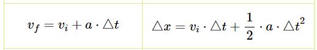

# TP1

#### :alarm_clock: [Date de remise le dimanche 22 mai 2022 à 23h59]

## Objectif

Ce TP a pour objectif de vous introduire à l'algorithmie avec le langage de programmation Python. Celui-ci est composé de 4 parties, pour lesquelless vous devez compléter le code avec l'indicateur `TODO`.

Les parties sont en ordre de difficulté, donc je vous conseille de les faire en ordre 😉

## Grille de correction

Le TP est sur 25 points. Les fonctions de la partie 1 valent 1 point chaque, les fonctions de la partie 2 valent 3 points chaque et les fonctions de la partie 3 valent 4 points chaque. La partie 4 est un petit bonus de 3 points pour ceux qui aimeraient un problème un peu plus compliqué.

Une démarche de qualité et un bon résultat donnent la note maximale. Une erreur minime (ex faute de frappe) mènera à une pénalité de 0.5 points. Puisqu'il s'agit d'un cours de programmation, une attention particulière sera accordée à la qualité du code. La note possible maximale du TP est 100% (même si vous avez tout bon plus le bonus).

Un code qui ne roule pas est un 0 automatique, alors testez votre code!!

## Consignes à respecter

Tout d'abord, assurez-vous d'avoir lu le fichier [Instructions.md](Instructions.md) et d'avoir téléchargé les fichiers parties 1-4.py que vous devrez complété.

Aussi, vous ne pouvez pas importer d'autres librairies que celle qui sont déjà importées dans les fichiers.

## Rouler le code

Lancez le fichier calculatrice.py afin de tester vos fonctions.

## Partie 1: 1 pt par fonction

Dans cette partie, il s'agira de compléter les fonctions `additionner`, `soustraire`, `multiplier` et `diviserAvecReste`. Il s'agit de fonctions de base pour vous familiariser avec les éléments des fonctions.
Toutes les fonctions prennent en entrée 2 nombres, a et b, et retournent le résultat de l'opération. La fonction `diviserAvecReste` retourne deux éléments, le quotient (résultat de la division) et le reste.
La partie 1 se trouve dans le fichier partie1.py

Voici des exemples d'exécution:

```python
    somme = add(1,2) # somme = 3
    difference = soustraire(5,2) # difference = 3
    produit = multiplier(10, 2) # produit = 20
    quotient, reste = diviserAvecReste(8,3) # quotient = 2.666, reste = 2
```

## Partie 2: 3 pts par fonction

Dans cette partie, il s'agira de compléter les fonctions `calculerMinutes`, `arrondir` et `calculerNombreA`.
Il s'agit de fonctions un peu plus complexes.

La fonction `calculerMinutes` prends en entrée des nombres représentant des nombres d'années, de mois, de jours, d'heures, de minutes et de secondes. Le but de la fonction est de calculer le nombre total de minutes que représentent cette durée. Par exemple:

```python
    nbMinutes = calculerMinutes(0, 8, 2, 3, 50, 30) # il y a nbMinutes = 348710.5 minutes dans 0 ans, 8 mois, 2 jours, 3 heures, 50 minutes et 30 secondes
```

NOTE: On considère qu'un mois est 30 jours et une année est 365 jours

La fonction `arrondir` prend en entrée deux entiers, soit un nombre et un facteurArrondissement. Le but est d'arrondir le nombre au multiple le plus proche du facteurArrondissement. Par exemple:

```python
    arrondiA = arrondir(8, 3) # 8 arrondi à un facteur 3 vaut arrondiA = 9
    arrondiB = arrondir(12, 5) # 12 arrondi à un facteur 5 vaut arrondiB = 10
    arrondiC = arrondir(34, 50) # 34 arrondi à un facteur 50 vaut arrondiC = 50
    arrondiD = arrondir(2, 10) # 2 arrondi à un facteur 10 vaut arrondiD = 0
```

Regardez bien les commentaires pour vous aider dans la résolution de ce problème!

La fonction `calculerNombreA` prend en entrée un mot et retourne un entier représentant le nombre de fois que le mot contient la lettre a. Par exemple:

```python
    nbA = calculerNombreA("Ananas") # Ananas contient nbA = 3 fois la lettre a
    nbB = calculerNombreA("Bouteille") # Boutille contient nbB = 0 fois la lettre a
```

## Partie 3: 4 pts par fonction

Dans cette partie, il s'agira de compléter les fonctions `operationListe`, `enleverDoublons` et `calculerPosVitesseAChaqueTic`. Il s'agit de fonctions plus difficiles, et vous n'avez pas la structure déjà faite en commentaires.

La fonction `opérationListe` prend en entrée une liste d'entiers et calcule une nouvelle liste selon la règle suivante:
NouvelleListe_i est égal à 3 * listeA_i + 2 * B_i, le tout divisé par 6. Par exemple:

```python
    listeA = [1, 2, 3, 4]
    listeB = [5, 5, 5, 5]
    listeC = operationListe(listeA, listeB) # listeC = [2.1666, 2.666, 3.166, 7.333]
```

La fonction `enleverDoublons` prend en entrée une liste d'entiers et retourne une nouvelle liste sans qu'il y ait de nombres dupliqués. Vous devez réaliser ce problème en passant au travers la liste. Par exemple:

```python
    listeA = [1,7,4,6,7,8,4,3,2,4,4,4,4,4]
    listeB = enleverDoublons(listeA) # listeB = [1, 7, 4, 6, 8, 3, 2]
```

Finalement, la fonction `calculerPosVitesseAChaqueCapture` sert à calculer la vitesse et la position d'un véhicule après un certain nombre de tics. Elle prend en entrée _positionInit_ et  _vistesseInit_ qui représentent les conditions initiales du système. Elle prend également en entrée _acceleration_, qui devra être appliquée à la vitesse et à la position afin de trouver leurs valeurs finales. Finalement, elle prend en entrée _nbCaptures_, qui représente le nombre de captures qu'on fera, ainsi que _secondesEntreCaptures_, qui représente le nombre de secondes entre chaque capture.

Pour chaque capture, on voudra donc sauvegarder la position et la vitesse à ce moment dans deux tableaux séparés. Les équations du MRUA, tirées d'[alloprof](https://www.alloprof.qc.ca/fr/eleves/bv/physique/les-equations-du-mrua-p1010), pourrons certainement vous aider:



Par exemple:

```python
    positionInit = 10 # en m
    vitesseInit = 0 # en m/s
    acceleration = 2 # en m/s
    nbCaptures = 4
    secondesEntreCaptures = 1 # en s
    positions, vitesses = calculerPosVitesseAChaqueCapture(positionInit, vitesseInit, acceleration, nbCaptures,secondesEntreCaptures)
    # positions = [10.0, 11.0, 14.0, 19.0, 26.0]
    # vitesses = [0.0, 2.0, 4.0, 6.0, 8.0]
```

## Partie Bonus: 3 pts

La partie 4 est un petit bonus FACULTATIF pour ceux qui voudraient un défi supplémentaire. Il s'agit de compléter la fonction `rotationListe`, qui fait tourner les éléments d'une liste vers la droite ou la gauche. Elle prend en entrée une liste d'entiers, un nombre qui indique combien de rotations on souhaite réaliser, et un booléen qui indique si on tourne vers la droite ou vers la gauche. Une rotation de 1 vers la droite signifie que tous les éléments de la liste se tassent d'une position vers la droite. Par exemple:

```python
    listeA = [1,2,3,4,5]
    rotation = 3
    estVersDroite = True # on pivote vers la droite

    listeRotDroite = rotationListe(listeA, rotation, estVersDroite) # listeRotDroite = [4,5,1,2,3]
    # Explication:
    #  DEBUT      ->  ROTATION #1 -> ROTATION #2 -> ROTATION #3
    # [1,2,3,4,5] -> [5,1,2,3,4] -> [4,5,1,2,3] -> [3,4,5,1,2]

    listeB = [1,2,3,4,5]
    rotation = 2
    estVersDroite = False # on pivote vers la gauche

    listeRotGauche = rotationListe(listeB, rotation, estVersDroite) # listeRotGauche = [3,4,5,1,2]
    # Explication:
    #  DEBUT      ->  ROTATION #1 -> ROTATION #2
    # [1,2,3,4,5] -> [2,3,4,5,1] -> [3,4,5,1,2]
```

Quand vous utilisez la calculatrice, pour entrer la valeur de estVersDroite, utilisez 1 pour Vrai et 0 pour Faux, sinon vous
aurez des problèmes de valeur!

## REMISE

Je corrigerai votre dernier commit sur le repo. Il est très important de push au moins une fois avant la remise pour voir si tout fonctionne! Faites également très attention aux conflits Git de dernière minute.

Et voilà! N'oubliez pas de tester votre code 😀
